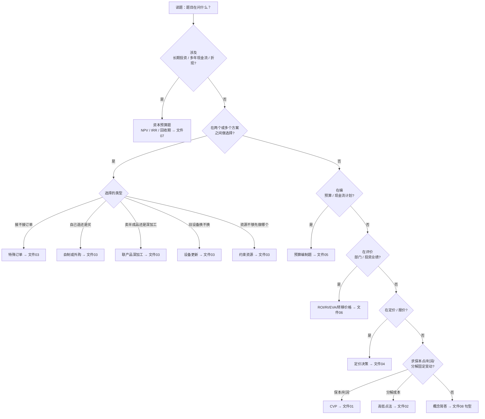

# 00 · 题型总览 + 图解索引

> 本目录是第二遍复习：**按"题型"组织，用题讲题**。每个题型都给你：
> ①一句话识别 → ②解题模板（步骤） → ③图解 → ④精讲例题（完整步骤） → ⑤变式与陷阱 → ⑥**英文作答句型**。
>
> 配套「全英作答」需求，每个计算题型都附了英文答题模板；系统性的英文工具见 [`08-全英作答工具包.md`](08-全英作答工具包.md)。

---

## 一、本门课的全部题型地图

> ✅计算大题 = 真正会考的 50 分计算（仅 2/5/6/11 章）；🔧概念 = 已降级为只考概念；⛔ = 不考。

| # | 题型 | 所属章 | 考试地位 | 文件 |
|---|------|-------|:---:|------|
| 1 | 本量利（贡献式利润表/保本点/目标利润/安全边际） | 2 | ✅**计算大题** | [`01-CVP本量利.md`](01-CVP本量利.md) |
| 3 | 相关成本决策（特殊订单/自制外购/产品线增删/深加工/设备更新/约束资源） | 5,6 | ✅**计算大题** | [`03-相关成本决策.md`](03-相关成本决策.md) |
| 4 | 定价决策（成本加成/最低报价/目标成本）+ 完全vs变动成本利润表 | 5 | ✅**计算大题** | [`04-定价与目标成本.md`](04-定价与目标成本.md) |
| 7 | 资本预算（NPV/IRR/回收期/ARR/折旧税盾） | 11 | ✅**计算大题** | [`07-资本预算.md`](07-资本预算.md) |
| 8 | **概念辨析 + 简答（英文，50分）** | 1/3/7/8/9等 | ✅**选择+简答** | [`09-概念与简答英文模板.md`](09-概念与简答英文模板.md) |
| — | 全英作答工具包 | 全部 | 通用 | [`08-全英作答工具包.md`](08-全英作答工具包.md) |
| 2 | 混合成本分解（高低点法） | 3 | 🔧仅理解概念，不手算 | [`02-高低点法.md`](02-高低点法.md) |
| 5 | 预算编制（现金预算等） | 7 | 🔧仅理解概念，不编表 | [`05-预算编制.md`](05-预算编制.md) |
| 6 | 业绩评价（ROI/RI/EVA/转移价格） | 10 | ⛔**不考** | [`06-业绩评价与转移价格.md`](06-业绩评价与转移价格.md) |

---

## 二、拿到一道题，如何判断它是哪种题型？



---

## 三、贯穿所有计算题的"万能四步"

无论哪种题型，考场上都先套这个骨架（详见 `review/00-备考总策略`）：

```
第1步  判题型（用上面的流程图）
第2步  画骨架（贡献式三层表 / 多方案并列表 / 预算表 / NPV 表）
第3步  填数据（剔除沉没成本，保留"未来+有差异"，标出机会成本）
第4步  下结论 + 一句定性 + （若要求）英文句型作答
```

---

## 四、图解类型说明（本目录用到的图）

- **流程图（decision flowchart）**：用于"判断题型""相关/不相关判断""自制外购流程"等——GitHub 自动渲染 Mermaid。
- **本量利图（CVP graph）**：收入线、总成本线、保本点——用直观示意图呈现。
- **结构图**：全面预算体系、平衡计分卡因果链。

> 如果在 GitHub 网页上看不到图形，是因为 Mermaid 需要联网渲染；代码块本身也写得能直接读懂。
