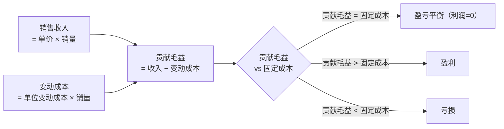

# 题型1 · 本量利分析（CVP）

> 一句话识别：题目出现"**保本/盈亏平衡、目标利润、安全边际、单价/单位变动成本/固定成本**"，就是 CVP 题。
> 对应章节：第2章。这是最套路化的题型，公式固定，列对表就能得分。

---

## 一、解题模板（背下来）

```
单位贡献毛益 = 单价 − 单位变动成本
贡献毛益率   = 单位贡献毛益 ÷ 单价

① 保本销量   = 固定成本 ÷ 单位贡献毛益
② 保本销售额 = 固定成本 ÷ 贡献毛益率
③ 目标利润销量 = (固定成本 + 目标利润) ÷ 单位贡献毛益
④ 含税：税前利润 = 税后利润 ÷ (1 − 税率)，再代入③
⑤ 安全边际 = 预计销售 − 保本销售；安全边际率 = 安全边际 ÷ 预计销售
```

---

## 二、图解：本量利关系图（保本点）



本量利图（横轴=销量，纵轴=金额）示意：

```
金额
 ↑                              销售收入线 TR
 │                          ╱
 │                      ╱        ← 这段是利润区
 │                  ╱  ●  总成本线 TC
 │              ╱ ╱
 │          ╱ ╱      ← 保本点：TR 与 TC 相交处
 │      ╱ ╱
 │  ╱ ╱  ← 这段是亏损区
 │╱──────────────────── 固定成本线 FC（水平）
 └─────────────┼──────────────→ 销量
           保本销量
```
- 保本点：销售收入线与总成本线的交点；交点左边亏损、右边盈利。
- 固定成本线水平不动；总成本线 = 固定成本 + 变动成本（斜率=单位变动成本）。

---

## 三、精讲例题（一道吃透全部考点）

> **【题】** Sunny 公司生产单一产品：单价 $50，单位变动成本 $30，年固定成本 $120,000，预计年销量 8,000 件，所得税率 40%。
> 求：(1) 单位贡献毛益与贡献毛益率；(2) 保本销量与保本销售额；(3) 预计营业利润；(4) 实现税后利润 $30,000 需销多少件；(5) 安全边际及安全边际率。

**第1步 算单位贡献毛益**
```
单位贡献毛益 = 50 − 30 = $20
贡献毛益率   = 20 ÷ 50 = 40%
```

**第2步 保本点**
```
保本销量   = 120,000 ÷ 20 = 6,000 件
保本销售额 = 120,000 ÷ 40% = $300,000   （验证：6,000×50 = 300,000 ✓）
```

**第3步 预计营业利润（贡献式利润表）**

| 项目 | 金额 |
|------|------|
| 销售收入 8,000×50 | 400,000 |
| 变动成本 8,000×30 | 240,000 |
| **贡献毛益** | **160,000** |
| 固定成本 | 120,000 |
| **营业利润** | **40,000** |

**第4步 含税目标利润**
```
税前利润 = 30,000 ÷ (1 − 40%) = 50,000
所需销量 = (120,000 + 50,000) ÷ 20 = 8,500 件
```

**第5步 安全边际**
```
安全边际(件) = 8,000 − 6,000 = 2,000 件
安全边际(额) = 400,000 − 300,000 = $100,000
安全边际率   = 100,000 ÷ 400,000 = 25%
```

---

## 四、变式与陷阱

- **多产品**：先分产品算贡献毛益再合计，固定成本统一减（见 review 第2章 2-43）。
- **给的是"变动成本率"而非单位数**：贡献毛益率 = 1 − 变动成本率。
- **含税**：务必先把税后利润 ÷(1−税率) 还原为税前，再进公式（最易漏）。
- 贡献毛益率分母是**单价**，不是成本。

---

## 五、英文作答模板（全英作答用）

> 把数字填进句子即可，表格行用英文标签。

**表格英文标签**：Sales / Variable costs / **Contribution margin** / Fixed costs / **Operating income**

**结论句型**：
- "The unit contribution margin is $20 (= $50 selling price − $30 variable cost), and the contribution margin ratio is 40%."
- "The break-even point is **6,000 units** (or **$300,000** in sales), computed as fixed costs of $120,000 divided by the unit contribution margin of $20 (or by the 40% CM ratio)."
- "To earn an **after-tax** profit of $30,000, the required pre-tax profit is $50,000 [= $30,000 ÷ (1 − 0.40)], so the company must sell **8,500 units**."
- "The margin of safety is **2,000 units** (or **$100,000**, a 25% margin of safety ratio)."
