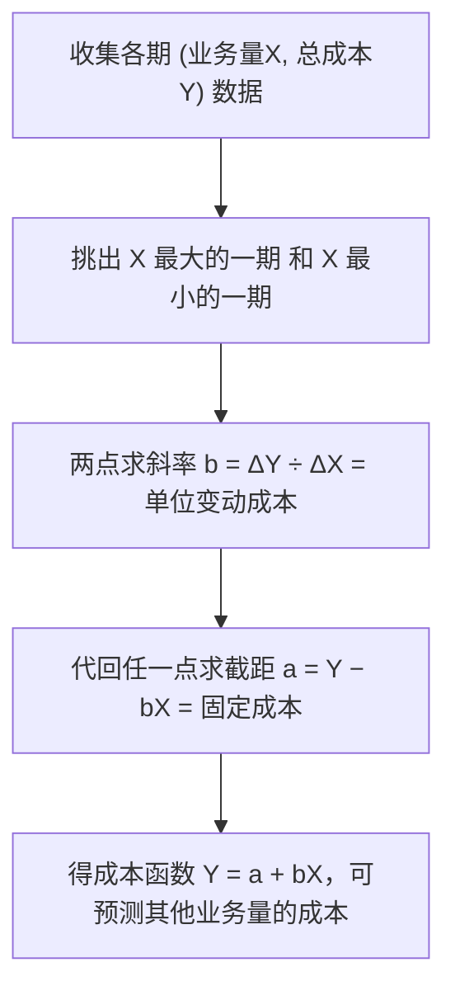

# 题型2 · 混合成本分解（高低点法）

> 一句话识别：题目给"**几个月（或几期）的业务量 + 对应总成本**"，让你**估出固定成本和单位变动成本**，就是高低点法。
> 对应章节：第3章。

> 🔧 **考纲提醒**：本次考试**不要求手算高低点法**（第3章不出计算大题）。本文保留供你**理解成本如何分解的原理**；真正要会的是：当题目**直接给出**固定/变动成本时，代入第2章 CVP 计算。

---

## 一、解题模板（两步走）

```
第1步  单位变动成本 b = (最高业务量点的成本 − 最低业务量点的成本)
                         ÷ (最高业务量 − 最低业务量)
第2步  固定成本 a = 任一点总成本 − b × 该点业务量
       → 成本函数：Y = a + bX
```

⚠️ **高低点是按"业务量 X"取最高/最低，不是按成本取！** 这是唯一的坑。

---

## 二、图解：高低点法在做什么



直观图（两点连一条直线）：
```
总成本 Y
 ↑
 │                      ● 高点(2000h, 18000)
 │                  ╱
 │              ╱   ← 斜率 b = 单位变动成本
 │          ╱
 │      ● 低点(1200h, 13200)
 │  
a├─ ← 直线延伸到 X=0 处的截距 = 固定成本
 └────────────────────→ 业务量 X
```

---

## 三、精讲例题

> **【题】** 某车间维修成本与机器工时数据如下，用高低点法分解成本，并预测 1,500 机器工时时的维修成本。

| 月份 | 机器工时 | 维修成本 |
|------|---------|---------|
| 1月 | 1,400 | $14,000 |
| 2月 | **2,000（最高）** | $18,000 |
| 3月 | 1,600 | $15,500 |
| 4月 | **1,200（最低）** | $13,200 |

**第1步 取业务量最高(2,000h)、最低(1,200h)两点求 b**
```
b = (18,000 − 13,200) ÷ (2,000 − 1,200) = 4,800 ÷ 800 = $6 / 机器工时
```

**第2步 求固定成本 a**
```
用高点：a = 18,000 − 6 × 2,000 = 18,000 − 12,000 = $6,000
用低点验算：a = 13,200 − 6 × 1,200 = 13,200 − 7,200 = $6,000  ✓
成本函数：Y = 6,000 + 6X
```

**预测 1,500 工时**
```
Y = 6,000 + 6 × 1,500 = $15,000
```

---

## 四、变式与陷阱

- **千万别用成本最高/最低的月份**（本题3月成本15,500不是最低，但工时也不是极值，直接忽略；只用2月和4月）。
- 两点都可代入求 a，**用另一点验算**能防止算错。
- 若题目改问"业务量增加 X 单位，成本增加多少" → 直接答 `b × X`（固定成本不变）。

---

## 五、英文作答模板

**结论句型**：
- "Using the high-low method, the **variable cost per machine hour** is $6, computed as the change in cost ($18,000 − $13,200) divided by the change in activity (2,000 − 1,200 hours)."
- "The **fixed cost** is $6,000 [= $18,000 − ($6 × 2,000)]."
- "The cost function is **Y = $6,000 + $6X**. At 1,500 machine hours, total maintenance cost is predicted to be **$15,000**."
