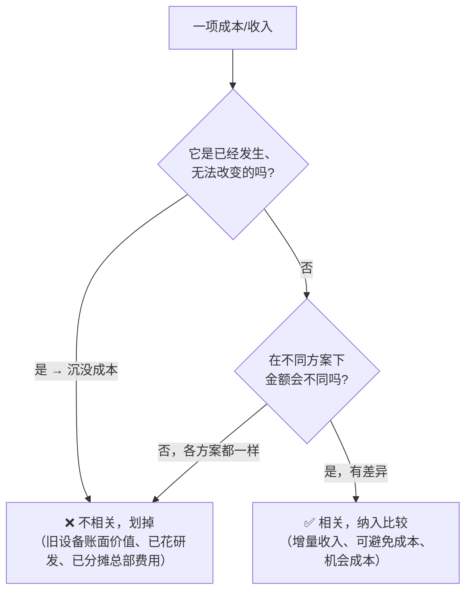
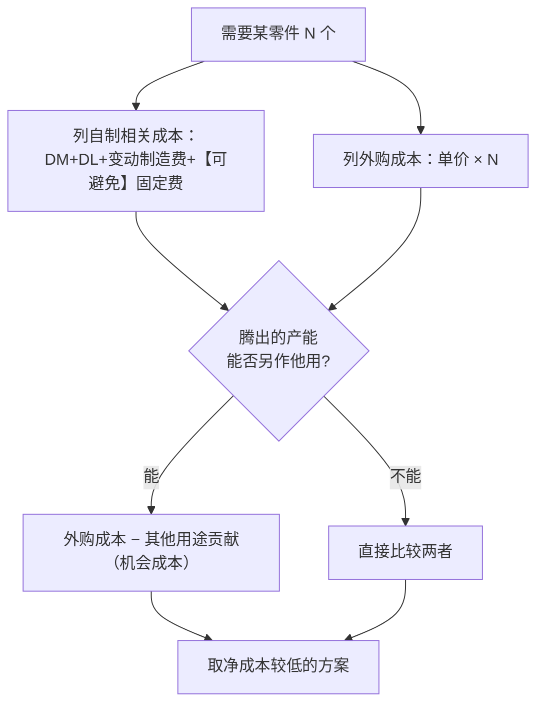

# 题型3 · 相关成本决策（五大子题型）

> 一句话识别：题目让你在**两个/多个方案之间做选择**——接不接订单、自制还是外购、卖半成品还是深加工、旧设备换不换、资源不够先做谁。
> 对应章节：第5、6章。这是**分值最高、最常考的大题**。

---

## 〇、所有决策题的"总开关"：相关 or 不相关？



> **黄金口诀：只比"未来 + 有差异"的现金性项目。** 沉没成本、不可避免的分摊费用，统统先划掉。

---

## 子题型 3.1 · 特殊订单（接 or 不接）

**模板**（前提：**有闲置产能**）：
```
增量贡献毛益 = 增量收入 − 增量变动成本
若 > 0 且固定成本不变 → 接受；并补一句定性判断
```

**精讲例题**：正常产销 10,000 件、产能 12,000 件，正常售价 $25，单位变动成本 $15，固定成本 $60,000。某客户一次性订 1,500 件、出价 $18。是否接受？
```
闲置产能 = 12,000 − 10,000 = 2,000 件 ≥ 1,500 → 不挤占正常销售 ✓
增量贡献毛益 = 1,500 × (18 − 15) = 1,500 × 3 = +$4,500
固定成本不变 → 接受，利润增加 $4,500
```
> 定性提醒：是否会冲击正常 $25 售价/引来老客户压价？若是则可能拒绝（真题 5-36 即此类）。
> 若**没有闲置产能**，要扣减被挤占正常订单的贡献毛益（机会成本）。

---

## 子题型 3.2 · 自制或外购（Make-or-Buy）



**精讲例题**：需要 20,000 个零件。自制：直接材料 $4、直接人工 $3、变动制造费 $2，可避免固定制造费 $20,000；外购单价 $11。
```
自制相关成本 = 20,000 × (4+3+2) + 20,000 = 180,000 + 20,000 = $200,000（单位$10）
外购成本     = 20,000 × 11 = $220,000
→ 自制便宜 $20,000，应【自制】
```
**变式（加机会成本）**：若外购后空出的厂房可另接业务、贡献 $30,000：
```
外购净成本 = 220,000 − 30,000 = $190,000 < 自制 200,000 → 改为【外购】
```
> 只有**可避免**的固定成本才相关；已分摊但不可避免的总部费用两边都不算（真题 6-32、6-33、6-34）。

---

## 子题型 3.3 · 联产品：分离点出售 or 继续加工

**模板**（**联合成本不相关**，只比分离点之后）：
```
增量收入（深加工后售价 − 分离点售价，再×数量）  vs  分离点后的可分加工成本
增量收入 > 可分成本 → 继续加工；否则在分离点直接卖
```

**精讲例题（真题 6-37）**：产品 M，2,500,000 加仑。分离点卖 30¢/加仑；深加工成 Super M 卖 38¢/加仑，需可分成本 $210,000。

| | 分离点卖 M | 深加工 Super M | 差异 |
|---|---|---|---|
| 收入 | 750,000 | 950,000 | +200,000 |
| 分离点后可分成本 | — | 210,000 | (210,000) |
| **净结果** | 750,000 | 740,000 | **−10,000** |

→ 增量收入 200,000 < 可分成本 210,000 → **不深加工，分离点直接卖**。联合成本无论哪方案都一样，忽略。

---

## 子题型 3.4 · 设备更新（保留 or 替换）

**四项目相关性（背！）**：

| 项目 | 相关? |
|------|:----:|
| 旧设备 账面价值 / 折旧 / 账面冲销 | ❌ 沉没 |
| 旧设备 现在处置(变现)价值 | ✅ 现金流入 |
| 新设备 购置成本 | ✅ 现金流出 |
| 未来经营成本差异 | ✅ |

**精讲例题（真题 6-40，5年合计）**：

| | 保留 | 替换 | 差异(利于替换) |
|---|---|---|---|
| 现金经营成本(5年) | 22,500 | 10,000 | 12,500 |
| 旧机处置价值 | — | (3,000) | 3,000 |
| 新机购置成本 | — | 12,500 | (12,500) |
| **合计** | 27,500 | 24,500 | **+3,000** |

→ 替换 5 年共省 $3,000，**应替换**。
> 注意：旧机账面价值 $5,000 是沉没成本，无论保留还是冲销都一样，**不影响结论**，所以上表里干脆不单列它（别被"处置损失 2,000"迷惑）。

---

## 子题型 3.5 · 约束资源（先做哪个产品）

**模板**：按**每单位约束资源的贡献毛益**排序，高的优先：
```
排序依据 = 单位产品贡献毛益 ÷ 单位产品耗用的约束资源
（不是按单位贡献毛益排！）
```

**精讲例题**：机器工时只有 1,000 小时。

| 产品 | 单位贡献毛益 | 单位耗用工时 | **每工时贡献毛益** |
|------|:---:|:---:|:---:|
| A | $12 | 2h | **$6/h** ← 优先 |
| B | $20 | 5h | $4/h |
```
虽然 B 的单位贡献毛益更高($20)，但每受限工时只赚 $4；
A 每工时赚 $6 → 在工时受限时，优先生产 A。
```

---

## 六、英文作答模板（决策题通用）

**表格英文标签**：Relevant costs / Avoidable costs / Opportunity cost / Differential (Incremental) / "Difference in favor of [making / buying / replacing]"

**结论句型**（套用即可）：
- 特殊订单："The company **should accept** the special order because it provides an **incremental contribution margin of $4,500**, and fixed costs do not change."
- 自制外购："The company **should make** the component because the relevant cost of making ($200,000) is **$20,000 lower** than the cost of buying ($220,000)."
- 深加工："Product M **should be sold at the split-off point** because the incremental revenue from further processing ($200,000) is **less than** the additional separable cost ($210,000); joint costs are **irrelevant**."
- 设备更新："The old machine **should be replaced** because total relevant costs over five years are **$3,000 lower**; the book value of the old machine is a **sunk cost** and is irrelevant."
- 约束资源："Product A should be produced first because its contribution margin **per machine hour** ($6) is higher than B's ($4)."
- 定性补充（万能尾句）："In addition, the company should consider qualitative factors such as supplier reliability, product quality, and the impact on regular customers."
