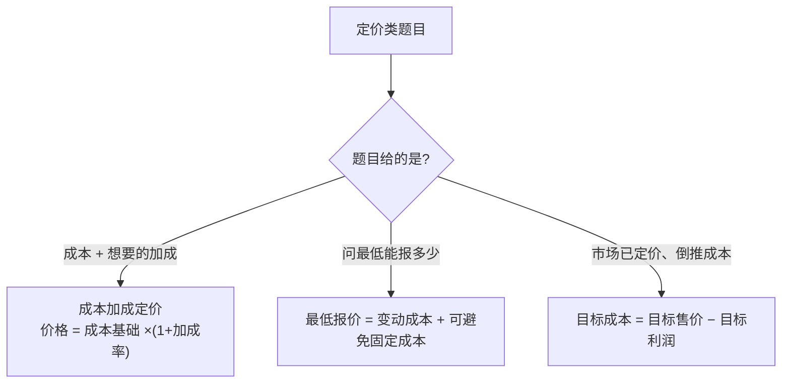

# 题型4 · 定价决策与目标成本

> 一句话识别：题目让你**定一个价/算加成率/算最低报价/判断能否按目标成本投产**。
> 对应章节：第5章。

---

## 一、三种子题型与模板



```
① 成本加成： 价格 = 成本基础 × (1 + 加成率)
            加成率 = (价格 − 成本基础) ÷ 成本基础
② 最低报价（短期保底）= 全部变动成本 + 可避免固定成本
   目标报价 = 全部相关与不可避免成本 + 期望利润加成
③ 目标成本 = 目标售价 − 目标利润   （现有成本 ≤ 目标成本 → 可投产）
```

---

## 二、精讲例题

### (1) 成本加成 / 加成率（真题 5-43）
某产品价格 $90,000，分别以不同成本基础求加成率：
```
基础=变动成本 36,000：(90,000 − 36,000) ÷ 36,000 = 150%
基础=制造成本 50,000：(90,000 − 50,000) ÷ 50,000 = 80%
基础=完全成本 30,000：(90,000 − 30,000) ÷ 30,000 = 200%
```
> 规律：成本基础越窄（只含变动），加成率越高。看清题目用哪个基础。

### (2) 最低报价 / 投标（真题 5-44）
总变动成本 $124,000，可避免固定成本 $9,000，不可避免固定成本 $35,000，期望加成 20%：
```
最低报价 = 124,000 + 9,000 = $133,000   （只覆盖相关成本的底线）
总成本   = 133,000 + 35,000 = $168,000
目标报价 = 168,000 × (1 + 20%) = $201,600
```

### (3) 目标成本法（真题 5-46）
目标售价 $230，目标利润率 20%：
```
目标成本 = 230 − 20%×230 = 230 − 46 = $184
现有单位成本 = 总成本 10,000,000 ÷ 50,000 件 = $200  > 184  →  不能投产
若降本：单位成本降到 $182 < 184 → 可投产
```

---

## 三、陷阱

- 加成率随"成本基础"变化，**先确认基础是变动/制造/完全成本中的哪个**。
- 最低报价**只含相关成本**（变动+可避免固定），不含不可避免的分摊费用。
- 目标成本法方向是"**价格倒推成本**"，与成本加成相反，别搞混。

---

## 四、英文作答模板

- "The markup percentage on **variable cost** is **150%**, computed as ($90,000 − $36,000) ÷ $36,000."
- "The **minimum bid** is **$133,000**, equal to total variable costs ($124,000) plus avoidable fixed costs ($9,000)."
- "The **target cost** is **$184** (= $230 target price − $46 target profit). Since the current unit cost of $200 **exceeds** the target cost, the product **should not** be released to production unless costs can be reduced below $184."
