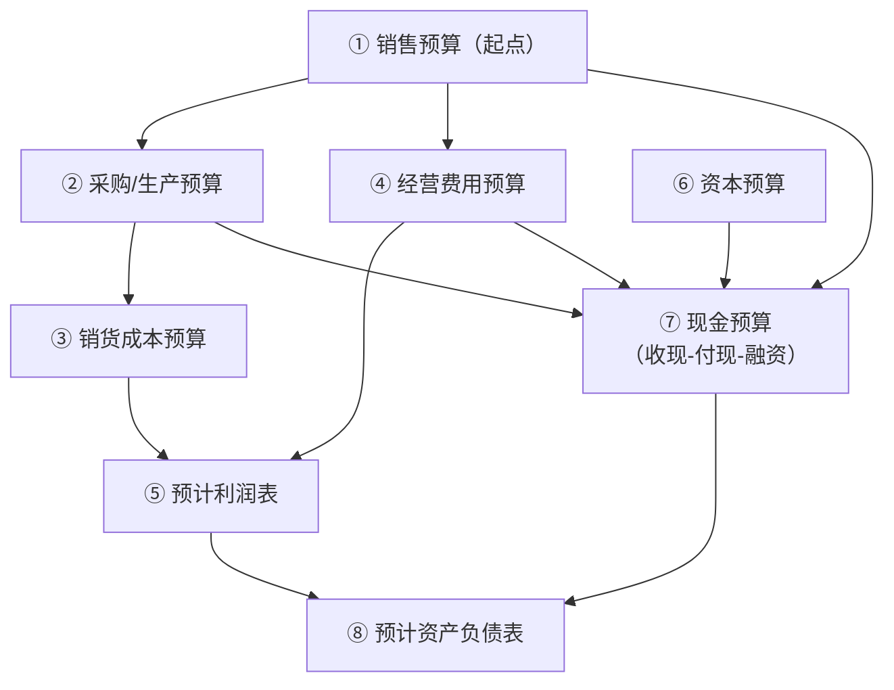

# 题型5 · 预算编制（销售/采购/现金预算）

> 一句话识别：题目让你**编制某种预算表**——尤其是**现金预算**（按收现比例算每月收到多少现金）。
> 对应章节：第7章。流程化，练一遍就稳。

---

## 一、全面预算结构（编制顺序图）



---

## 二、解题模板

```
采购预算 = 预计销货成本 + 期末存货 − 期初存货

现金预算：
   期初现金
 + 现金收入（本月收现 + 以前月份赊销在本月收回）
 − 现金支出（采购付现、工资费用、设备、税、利息…；【不含折旧】）
 = 融资前现金
 ± 融资（不足最低额→借款；有余→还款付息）
 = 期末现金（=下月期初）
```

⚠️ **现金预算只认真正收/付的现金**：折旧不进现金预算；赊销要按账期比例拆到对应月份。

---

## 三、精讲例题（现金预算）

> **【题】** 某公司销售收现政策：销售当月收 60%、次月收 30%、再次月收 10%。
> 各月销售额：4月 $100,000，5月 $120,000，6月 $140,000。
> 6月初现金 $20,000；6月采购付现 $90,000、付现经营费用 $25,000（不含折旧）、购设备 $15,000；公司要求月末最低现金 $15,000。
> 求 6月现金收入与 6月末现金余额。

**第1步 算6月现金收入（关键：按账期拆）**
```
来自6月销售：140,000 × 60% = 84,000
来自5月销售：120,000 × 30% = 36,000
来自4月销售：100,000 × 10% = 10,000
6月现金收入合计 = 84,000 + 36,000 + 10,000 = $130,000
```

**第2步 编6月现金预算**

| 项目 | 金额 |
|------|------|
| 期初现金 | 20,000 |
| + 现金收入 | 130,000 |
| = 可动用现金 | 150,000 |
| − 采购付现 | 90,000 |
| − 经营费用付现 | 25,000 |
| − 购置设备 | 15,000 |
| = 融资前现金 | 20,000 |
| 最低现金要求 | 15,000 |
| 需融资? | 否（20,000 ≥ 15,000） |
| **6月末现金余额** | **$20,000** |

---

## 四、陷阱

- **折旧绝不进现金预算**（但进预计利润表）。
- 收现一定按**账期比例拆月**，别把整月销售当本月现金。
- 采购预算别忘**期初/期末存货**调整。
- "利润 ≠ 现金"：有利润也可能因应收占用而缺现金。

---

## 五、英文作答模板

**表格英文标签**：Beginning cash balance / Cash collections (receipts) / Cash available / Cash disbursements (payments) / Ending cash balance / Financing

- "June cash collections total **$130,000**: 60% of June sales ($84,000) + 30% of May sales ($36,000) + 10% of April sales ($10,000)."
- "The **ending cash balance** for June is **$20,000**; since this exceeds the $15,000 minimum required balance, **no borrowing is needed**."
- "Depreciation is **not** included in the cash budget because it is a non-cash expense."
