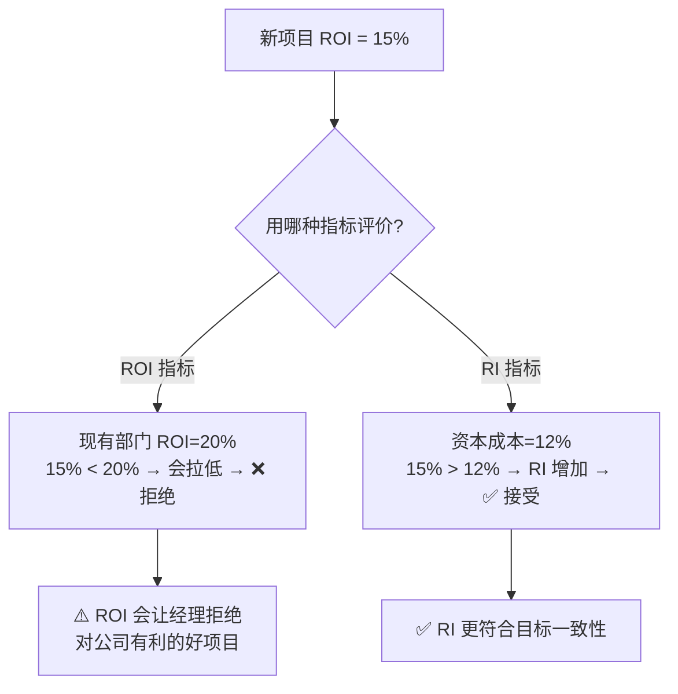

# 题型6 · 业绩评价（ROI/RI/EVA）与转移价格

> 一句话识别：题目评价**部门/投资中心业绩**（投资报酬率、剩余收益）或**内部部门之间定价**。
> 对应章节：第10章。公式套用即可，重点是 **ROI 与 RI 的对比题**。

---

## 一、解题模板

```
ROI(投资报酬率) = 营业利润 ÷ 投资额
              = (营业利润÷销售收入) × (销售收入÷投资额)   ← 杜邦分解

RI(剩余收益)    = 营业利润 − 投资额 × 最低报酬率

EVA(经济增加值) = 税后营业利润 − 税后资本成本率 ×(总资产 − 流动负债)

转移价格(一般准则) = 单位付现(增量)成本 + 单位机会成本
   · 供方有闲置产能 → 机会成本=0 → 下限=单位变动成本
   · 供方满负荷     → 机会成本=对外贡献毛益 → ≈ 市价
```

---

## 二、图解：ROI 与 RI 为什么会给出相反结论



---

## 三、精讲例题

> **【题】** 某事业部：营业利润 $300,000，销售收入 $1,500,000，占用投资 $1,500,000，公司要求最低报酬率 12%。
> (1) 求 ROI（含杜邦分解）与 RI。(2) 现有一新项目需投资 $200,000、每年带来营业利润 $30,000，分别用 ROI 和 RI 评价是否该上。

**(1) ROI 与 RI**
```
ROI = 300,000 ÷ 1,500,000 = 20%
  杜邦：销售利润率 = 300,000÷1,500,000 = 20%
        资本周转率 = 1,500,000÷1,500,000 = 1.0
        ROI = 20% × 1.0 = 20% ✓
RI  = 300,000 − 1,500,000 × 12% = 300,000 − 180,000 = $120,000
```

**(2) 新项目（ROI=30,000÷200,000=15%）**

| 评价指标 | 计算 | 结论 |
|---------|------|------|
| **ROI 法** | 新部门ROI=(300,000+30,000)÷(1,500,000+200,000)=330,000÷1,700,000≈**19.4%** < 20% | 经理会**拒绝**（拉低自己ROI） |
| **RI 法** | ΔRI = 30,000 − 200,000×12% = 30,000 − 24,000 = **+6,000** > 0 | 应**接受** |

> 这就是经典考点：新项目 15% > 资本成本 12%（对公司有利），但 < 现有 ROI 20%，**ROI 法会误拒，RI 法正确接受**。

---

## 四、转移价格精讲

> **【题】** A 部门生产某组件，单位变动成本 $40，外部市价 $70。B 部门想内部采购。最低转移价格应是多少？
```
情形1：A 有闲置产能 → 机会成本=0 → 最低转移价 = $40（单位变动成本）
情形2：A 满负荷生产（内供就得放弃外销）→ 机会成本 = 70−40 = 30
       → 最低转移价 = 40 + 30 = $70（即市价）
```

---

## 五、陷阱

- **ROI 是比率会"拒优"，RI 是绝对额更利于目标一致性**——必考对比。
- RI/EVA 别漏乘 `投资额 × 报酬率`（资本费用）。
- EVA 用**税后**利润与税后资本成本。
- 转移价格先判断供方**有无闲置产能**，再决定机会成本是 0 还是对外贡献毛益。

---

## 六、英文作答模板

- "The division's **ROI is 20%** (= $300,000 operating income ÷ $1,500,000 invested capital), and its **residual income is $120,000** [= $300,000 − (12% × $1,500,000)]."
- "Under **ROI**, the manager would **reject** the project because its 15% return is below the division's current 20% ROI. Under **residual income**, the project should be **accepted** because it earns a positive RI of $6,000 (its 15% return exceeds the 12% cost of capital). RI is better aligned with the company's overall goals."
- "When the supplying division has **idle capacity**, the minimum transfer price equals its **variable cost of $40**; at **full capacity**, it equals **$70** (variable cost plus the $30 opportunity cost of lost external sales)."
