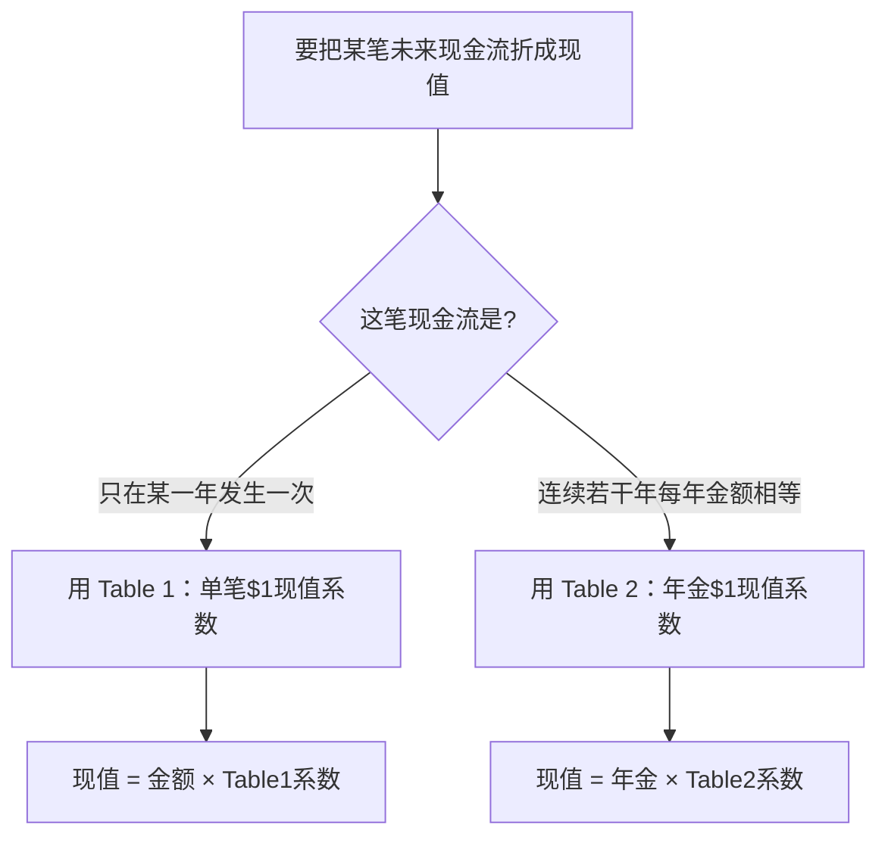
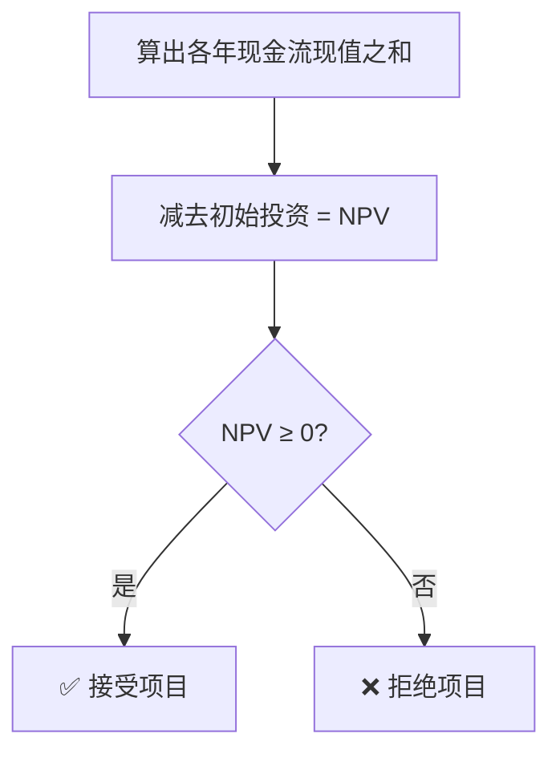

# 题型7 · 资本预算（NPV / IRR / 回收期 / 折旧抵税）

> 一句话识别：题目涉及**长期投资、多年现金流、折现率、现值系数**。
> 对应章节：第11章。计算量大、最易失分，**核心是分清两张现值表 + 折旧抵税**。

---

## 一、解题模板

```
NPV = Σ(各年现金流 × 折现系数) − 初始投资        （≥0 接受）
IRR：使 NPV=0 的折现率（年金情形可反查表）
回收期 = 初始投资 ÷ 年现金流（均匀时）

含税现金流：
  税后经营现金流 = 税前经营现金净流入 × (1 − 税率)
  折旧抵税额     = 折旧 × 税率        （折旧本身不是现金流！）
  税后净现金流   = 上面两项之和
```

---

## 二、图解：先选对现值表（头号失分点）





---

## 三、精讲例题

### (1) 标准 NPV + 回收期 + IRR（等额现金流）
> **【题】** 投资 $100,000，未来 5 年每年税后净现金流入 $30,000，必要报酬率 10%。
> 已知年金现值系数：(10%,5年)=3.7908；(14%,5年)=3.4331；(16%,5年)=3.2743。
```
NPV = 30,000 × 3.7908 − 100,000 = 113,724 − 100,000 = +$13,724  > 0 → 接受
回收期 = 100,000 ÷ 30,000 = 3.33 年
IRR：年金系数 = 100,000 ÷ 30,000 = 3.3333
     在5年行找：3.4331(14%) > 3.3333 > 3.2743(16%) → IRR ≈ 15%（>10% → 接受）
```
> NPV>0 与 IRR>资本成本 给出一致结论。

### (2) 折旧抵税（真题 11-41，税率 40%）
```
税前经营现金流入 = 收入1,200,000 − 付现成本600,000 = 600,000
所得税 @40% = 240,000  →  税后经营现金流 = 360,000
折旧400,000 抵税 = 400,000 × 40% = 160,000
税后净现金流合计 = 360,000 + 160,000 = $520,000
```

### (3) 由 NPV 求 IRR（真题 11-37）
```
10%：15,000×3.7908 − 54,072 = +2,790
12%：15,000×3.6048 − 54,072 =  0   → IRR = 12%
14%：15,000×3.4331 − 54,072 = −2,575
```
IRR 就是让 NPV=0 的利率；本例 12% > 资本成本 10% → 接受。

### (4) 不等额现金流 + 递延年金（真题 11-36，思路）
先把各年净现金流相减简化，再分段用系数折现求和，最后减初始投资得 NPV。

---

## 四、陷阱

- **看清 Table 1（单笔）还是 Table 2（年金）**——选错表整题崩。
- **折旧不是现金流出**，但"折旧 × 税率"是节省的税款（现金流入）。
- 经营现金流要 ×(1−税率)。
- **沉没成本/账面价值不相关**（与决策题一致）。
- 现金流出记负、流入记正；NPV = 流入现值 − 投资。
- 互斥方案排序：优先看 **NPV**。

---

## 五、英文作答模板

**表格英文标签**：Initial investment / Annual cash flow / PV factor / Present value / **Net present value** / Payback period

- "The **NPV is +$13,724** (= $30,000 × 3.7908 − $100,000). Since NPV is **positive**, the project **should be accepted**."
- "The **payback period** is **3.33 years** (= $100,000 ÷ $30,000)."
- "The **IRR is approximately 15%**, the rate at which NPV equals zero. Because the IRR exceeds the 10% required rate of return, the project **should be accepted**."
- "The **after-tax cash flow** is **$520,000**: after-tax operating cash flow of $360,000 [= $600,000 × (1 − 0.40)] plus the **depreciation tax shield** of $160,000 (= $400,000 × 0.40)."
